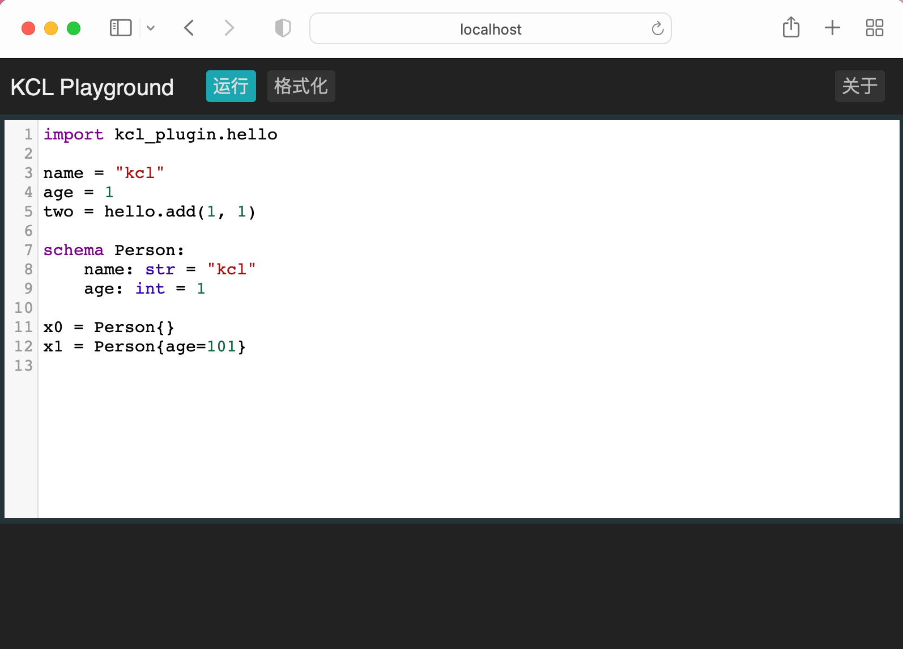

# KCL Playground

[](https://app.fossa.com/projects/git%2Bgithub.com%2Fkcl-lang%2Fkcl-playground?ref=badge_shield)

## Dependencies

+ Docker
+ Python 3.7+
+ Node.js

## Quick Start

```shell
python3 -m pip install -U -r ./requirements.txt
npm install
npm install -g pluto
make
```

## Run

```shell
pluto run
```

## Deploy

```shell
pluto deploy
```

## Screenshot



## License

Apache License Version 2.0

[](https://app.fossa.com/projects/git%2Bgithub.com%2Fkcl-lang%2Fkcl-playground?ref=badge_large)
